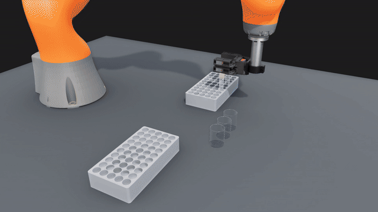

# Robot pick and place with liquid simulation



A KUKA iiwa with a Cartesian Hand takes capped tubes from a rack, twists the caps off, pours the liquid into beakers, puts the caps back on and places the tubes in a second rack.

I wanted the robot, the grasping, the caps and the liquid in one simulation that runs on my laptop GPU (RTX A3000, 6 GB). MuJoCo has no liquid simulation. Isaac Sim 6 needs at least an RTX 4080 with 16 GB, and its particle fluids have no Isaac Lab API. So I built this from smaller tools. cuRobo plans the motion, PhysX runs the rigid bodies, NVIDIA Warp runs the liquid, and threepp holds it all together and renders it.

## What is simulated

- **Robot.** The arm and the seven hand slides are one PhysX articulation with motors. cuRobo gives the targets and physics does the moving.
- **Grasping.** The fingertips hold the tube and the cap by friction only.
- **Cap off and on.** A joint holds the cap on the tube and breaks above a set pull. The hand twists the cap off, then presses and twists it back on.
- **Liquid.** A particle-based fluid (position based fluids) in NVIDIA Warp. It sloshes in the tube, pours out, settles in the beaker and pushes back on the tube.
- **Liquid types.** The demo pours water and soda with bubbles. Honey is in `src/sim/settings.py`.
- **Tubes in racks.** The wells are wider than the tubes, so the tubes lean. They tip into a lean again when the hand lets go.
- **Fixed parts.** The racks, beakers and table stay in place.

## Rendering

The live window uses OpenGL. The video uses threepp's Vulkan renderer with hardware ray tracing for light, soft shadows, reflections, glass and bounce light. Each frame is rendered at 1440p over 8 passes and scaled down to 1080p. Warp writes the liquid mesh straight into the renderer's buffers on the GPU.

## Setup

```bash
pip install -r requirements.txt
```

The planner runs in its own environment because cuRobo needs a PyTorch build for your CUDA version. Install PyTorch as in [cuRobo's install guide](https://github.com/NVlabs/curobo), then:

```bash
pip install -r src/planner/requirements.txt
```

For CUDA 12, change `cu13` to `cu12` in that file. The video also needs ffmpeg.

Download the robot meshes and write the URDF:

```bash
python src/utils/get_assets.py
```

Build the cuRobo robot config once, in the planner environment:

```bash
python src/planner/build_robot_config.py
```

## Run

Start the planner in its environment:

```bash
python src/planner/planner_server.py
```

Open the live window. The first run plans the task and saves it in `cache/`.

```bash
python src/sim/run_demo.py
```

Render the video:

```bash
python src/sim/render_video.py
```

All settings are in `src/sim/settings.py`.

## Other planners

The sim talks to the planner with six gRPC calls: Info, SetScene, PlanPose, PlanJoints, IKPath and FK. They are in `src/planner/planner_server.py`. To use another planner such as [PyRoki](https://github.com/chungmin99/pyroki), write a server that answers the same calls for the same URDF.

## Credits

| | License | |
|---|---|---|
| [Cartesian Hand](https://generalroboticslab.com/cartesian_handv1), General Robotics Lab, Duke | Apache-2.0 | [repo](https://github.com/generalroboticslab/Cartesian_Hand) |
| [iiwa_stack](https://github.com/IFL-CAMP/iiwa_stack) (iiwa14 meshes and joint values) | BSD-2-Clause | |
| [cuRobo](https://github.com/NVlabs/curobo) | Apache-2.0 | |
| [NVIDIA Warp](https://github.com/NVIDIA/warp) | Apache-2.0 | |
| [NVIDIA PhysX](https://github.com/NVIDIA-Omniverse/PhysX) (through threepp) | BSD-3-Clause | |
| [threepp](https://github.com/markaren/threepp) | MIT | |

`get_assets.py` downloads the robot meshes from their own repos.

```bibtex
@misc{xia2026cartesianhandinhandmanipulation,
  title         = {The Cartesian Hand: In-Hand Manipulation with All-Linear Fingers},
  author        = {Boxi Xia and Bokuan Li and Ryan Shin and Zijiang Yang and Jiaxun Liu and Boyuan Chen},
  year          = {2026},
  eprint        = {2609.25696},
  archivePrefix = {arXiv},
  primaryClass  = {cs.RO},
  url           = {https://arxiv.org/abs/2609.25696}
}

@misc{curobo_v2,
  title         = {cuRoboV2: Dynamics-Aware Motion Generation with Depth-Fused Distance Fields for High-DoF Robots},
  author        = {Balakumar Sundaralingam and Adithyavairavan Murali and Stan Birchfield},
  year          = {2026},
  eprint        = {2603.05493},
  archivePrefix = {arXiv},
  primaryClass  = {cs.RO}
}

@misc{warp2022,
  title        = {Warp: A High-performance Python Framework for GPU Simulation and Graphics},
  author       = {Miles Macklin},
  year         = {2022},
  month        = {March},
  note         = {NVIDIA GPU Technology Conference (GTC)},
  howpublished = {\url{https://github.com/NVIDIA/warp}}
}

@software{threepp,
  title  = {threepp},
  author = {Lars Ivar Hatledal},
  url    = {https://github.com/markaren/threepp}
}

@article{hennersperger2017towards,
  title   = {Towards MRI-based autonomous robotic US acquisitions: a first feasibility study},
  author  = {Hennersperger, Christoph and Fuerst, Bernhard and Virga, Salvatore and Zettinig, Oliver and Frisch, Benjamin and Neff, Thomas and Navab, Nassir},
  journal = {IEEE Transactions on Medical Imaging},
  volume  = {36},
  number  = {2},
  pages   = {538--548},
  year    = {2017}
}
```

## License

MIT, see [LICENSE](LICENSE).
